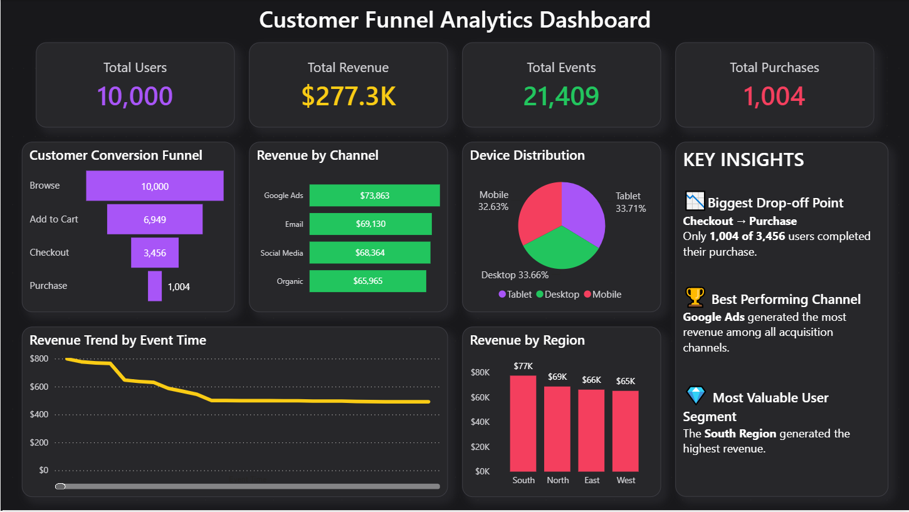

# 📊 Customer Funnel Analysis Dashboard (SQL + Power BI)

An end-to-end **Data Analytics** project that analyzes customer behavior across a digital platform using **SQL** and **Power BI**. The project focuses on **conversion funnel analysis**, **user journey analytics**, **revenue analysis**, and **interactive business intelligence** to uncover customer drop-off points and support data-driven decision-making.

> **LogicStack Data Analysis Internship – July 2026 | Week 4 Final Project**

---

# Project Overview

Understanding how users interact with a digital platform is essential for improving conversions and increasing revenue. In this project, I analyzed customer interactions from the first website visit to the final purchase, identified where users leave the conversion funnel, evaluated revenue across different business dimensions, and built an interactive Power BI dashboard to present actionable business insights.

The project combines SQL for analytical querying and Power BI for interactive visualization, demonstrating a complete data analytics workflow from raw data to business recommendations.

---

# Business Problem

A digital business wanted to answer several key questions about customer behavior:

- Where do customers drop off during the purchasing journey?
- Which marketing channels generate the highest revenue?
- Which regions perform the best?
- Which customer segments create the most business value?
- How can the conversion rate be improved?

This project answers these questions through data analysis and visualization.

---

# Project Objectives

- Analyze user behavior using SQL.
- Measure customer movement through the conversion funnel.
- Identify the biggest funnel drop-off points.
- Analyze revenue by channel, region, and device.
- Build an interactive Power BI dashboard for business users.
- Generate actionable business recommendations from data.

---

# Tools & Technologies

- **MySQL**
- **SQL**
- **Microsoft Power BI**
- **CSV Dataset**

---

# Dataset Summary

The dataset contains customer interaction events recorded on a digital platform.

### Dataset Information

| Metric | Value |
|---------|------:|
| Total Records | 21,409 |
| Unique Users | 10,000 |
| Dataset Format | CSV |
| Analysis Tools | SQL & Power BI |

### Dataset Features

- User ID
- Session ID
- Event Time
- Event
- Device
- Region
- Channel
- Product Category
- Revenue
- Bonus Flag

---

# Dashboard Features

The Power BI dashboard provides an interactive view of customer behavior and business performance.

### KPI Cards

- Total Users
- Total Revenue
- Total Events
- Total Purchases

### Interactive Visualizations

- Customer Conversion Funnel
- Revenue by Channel
- Revenue by Region
- Device Distribution
- Revenue Trend

# Dashboard Preview

  

---

# Project Files

| File | Description |
|------|-------------|
| **README.md** | Project overview and documentation |
| **sql_queries.sql** | SQL queries used for data exploration and analysis |
| **Business_Insights.md** | SQL insights, dashboard insights, and business recommendations |
| **customer_funnel_analytics.pbix** | Interactive Power BI dashboard |
| **Dashboard.png** | Dashboard screenshot |
| **client_site_dataset.csv** | Original dataset |

---

# Skills Demonstrated

- SQL Data Analysis
- Data Exploration
- Conversion Funnel Analysis
- Revenue Analysis
- Business Intelligence
- KPI Development
- Interactive Dashboard Design
- Data Visualization
- Business Insights
- Data-Driven Decision Making

---

# Internship Information

This project was completed as part of the **LogicStack Data Analysis Internship (July 2026)**.

The objective of this final project was to simulate a real-world business scenario by analyzing customer behavior, measuring conversion performance, identifying revenue opportunities, and delivering business insights through SQL and Power BI.

---

# About Me

**Sania Awan**

**Data Analytics Intern | Excel Specialist | Aspiring Data Analyst**

I'm passionate about transforming raw data into meaningful insights through SQL, Excel, Power BI, and data visualization. My goal is to build analytical solutions that support smarter business decisions.

---

⭐ **If you found this project interesting, consider giving it a star. Feedback and suggestions are always welcome!**
